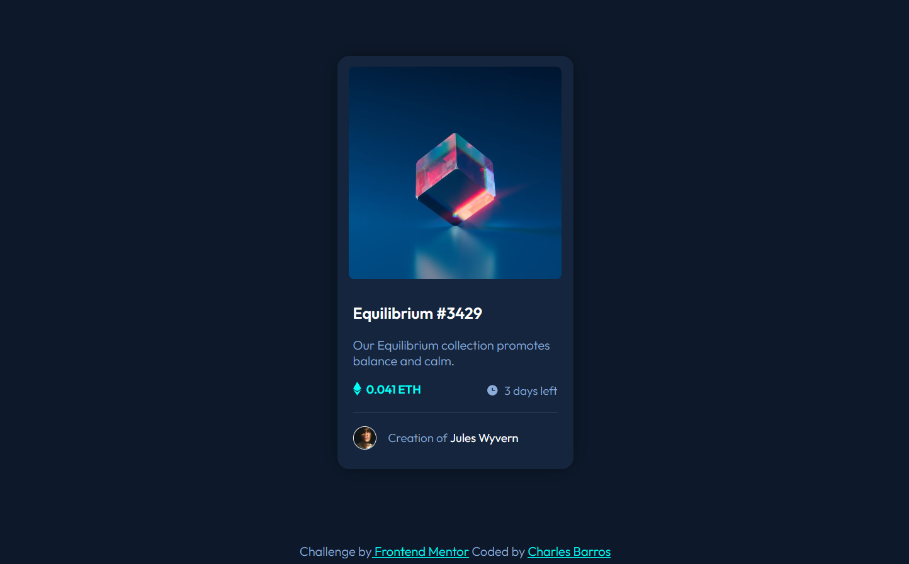

# NFT Card Challenge | Frontend Mentor | Charles Barros
This is my solution to the [NFT Card Challenge on Frontend Mentor](https://www.frontendmentor.io/challenges/nft-preview-card-component-SbdUL_w0U). Frontend Mentor challenges help you improve your coding skills by building realistic projects. 

## Table of contents

- [Overview](#overview)
  - [The challenge](#the-challenge)
  - [Screenshot](#screenshot)
  - [Links](#links)
- [My process](#my-process)
  - [Built with](#built-with)
  - [What I learned](#what-i-learned)
  - [Continued development](#continued-development)
  - [Useful resources](#useful-resources)
- [Author](#author)
- [Acknowledgments](#acknowledgments)

## Overview

### The challenge
This is my proposal of solution to the NFT Card Challenge on Frontend Mentor website and was my second non-tutorial project in frontend carrer. 
As the first one, this challenge consists of creating a simple static page using the jpg design file as reference and using only HTML5 and CSS3.

### Screenshot

### Links

- [Solution on Frontend Mentor](#)
- [Live at Versel](#)

## My process

### Built with
I started by configuring the project folder and initializing the version control sistem. Then I structured all the content senatically in HTML and started configuring the styles through CSS. After finalizing the entire content and layout, I made the commits of all the HMTL and CSS edits and I proceeded to finalize the interactions using CSS hover pseudo-classes.

### What I learned
Again a project with great learning, where I was able to apply and strengthen all the knowledge acquired with the previous challenge (QRCode) and add new knowledge such as the use of variables through the :root{} selector, the use of pseudo-class, especially hover and also use of new attributes in CSS such as z-index, pointer-events, among others.

### Continued development
I intend to continue carrying out the challenges of the Frontend Mentor platform, especially those initial ones that only require HTML and CSS and strengthen my foundations in these languages, while I'm still learning the initial concepts of JavaScript.

### Useful resources
I started using the W3C's HTML5 and CSS3 code validation tool to help me reduce errors and inconsistencies and build code better suited to current web development standards.
- [W3C Markup Validation Service](https://validator.w3.org/#validate_by_input) - HTML5 and CSS3 code compliance check

## Author

- Linkedin - [Charles Barros](https://www.linkedin.com/in/charles-barros/)
- Frontend Mentor - [@charbavito](https://www.frontendmentor.io/profile/charbavito)
- Github - [Charles (charbavito) Barros](https://github.com/charbavito)

## Acknowledgments

I thank the entire Frontend Mentor team for making this platform available with such useful and important content for those who are starting to venture into this Web Developer career. Thank you very much (again) :)